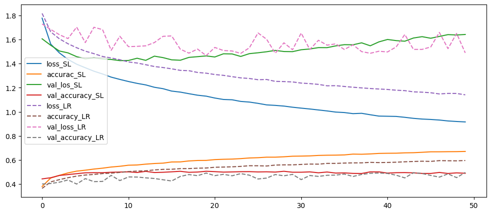
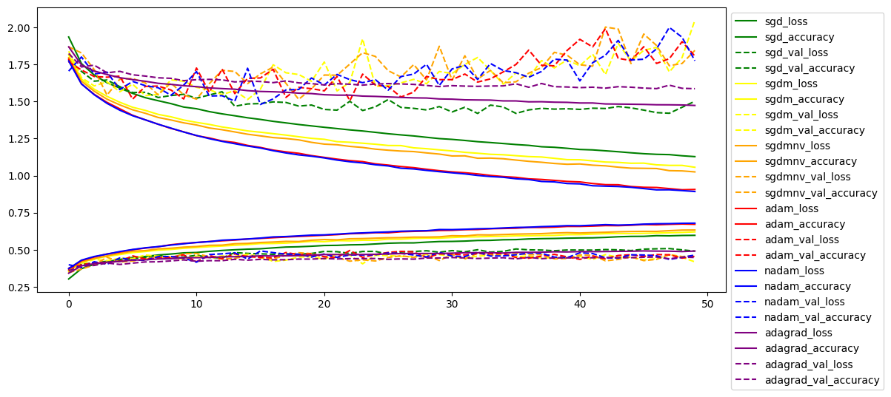
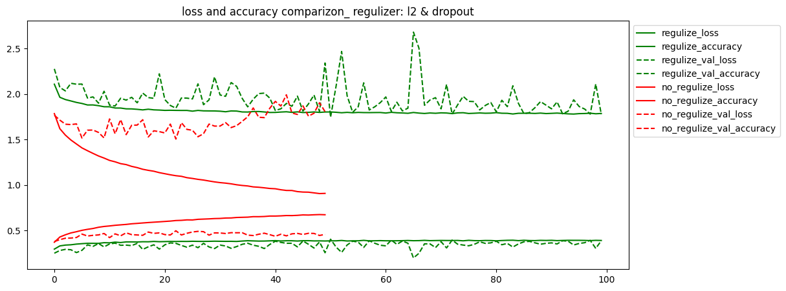

# 🧠 Deep Neural Network on CIFAR-10  
### Activation Functions, Transfer Learning, Optimizers & Regularization  

---

## 🎯 Project Overview  

This project explores **Deep Neural Networks (DNNs)** using the **CIFAR-10** dataset and demonstrates the impact of various deep learning techniques on model performance, including:

- Activation Functions  
- Transfer Learning  
- Optimization Algorithms  
- Regularization Strategies  

The implementation is done in **Python** using **TensorFlow** and **Keras**, executed in **Google Colab**.

---

## 📚 Dataset  

- **Name:** CIFAR-10  
- **Description:** 60,000 color images (32×32 pixels) across 10 distinct classes  
- **Data Split:** 85% training / 15% testing  

---

## ⚙️ Technologies & Libraries  

- **Platform:** Python (Google Colab)  
- **Frameworks:** TensorFlow, Keras  
- **Libraries Used:**
  - `numpy`  
  - `pandas`  
  - `matplotlib`  
  - `scikit-learn`  
  - `pickle`  
  - `time`  

---

## 🏗️ Base Model Architecture  

- **Dense Layer 1:** 50 neurons  
- **Dense Layer 2:** 100 neurons  
- **Output Layer:** 10 neurons with `softmax` activation  
- **Optimizer:** SGD  
- **Loss Function:** Categorical Crossentropy  
- **Metric:** Accuracy  

---

## 🔍 Project Tasks & Results  

### 1. 🔌 Activation Function Comparison  

Two activation functions were tested:
- **SELU** with self-normalizing weight initialization  
- **LeakyReLU** with Batch Normalization  

📊 **Result:**  
**SELU** achieved superior accuracy and lower loss on both training and validation datasets over 50 epochs.



---

### 2. 🐎 Transfer Learning – Horse Classification (Binary)  

- The best model from earlier stages was reused and modified for binary classification.  
- A subset of **6,000 CIFAR-10** samples was used.  
- The output layer was modified to use `sigmoid`.  

Two configurations were compared over 10 epochs:

| Configuration      | Frozen Layers | Accuracy | Training Time |
|--------------------|---------------|----------|----------------|
| Scenario 1         | 4 frozen      | 0.9003   | 73.30 sec       |
| Scenario 2         | All trainable | 0.9031   | 91.14 sec       |

✅ Training time increased slightly with more trainable layers.  
The small improvement in accuracy suggests further training could lead to better results.

---

### 3. ⚙️ Optimizer Comparison (50 Epochs)  

**Tested Optimizers:**
- SGD  
- SGD with Momentum  
- Nesterov Momentum  
- AdaGrad  
- Adam  
- Nadam  

📊 **Result Summary:**
- **Adam** and **Nadam** yielded better training accuracy and lower loss.
- **SGD variants** generalized slightly better on validation data.



---

### 4. 🛡️ Regularization Techniques (100 Epochs)  

**Applied Techniques:**
- Dropout  
- Monte Carlo Dropout (MC Dropout)  
- L1-L2 Regularization  

📈 **Results:**

| Regularization Method | Test Accuracy |
|------------------------|----------------|
| Dropout                | 0.4183         |
| MC Dropout             | 0.4227         |

✅ **Regularization** reduced overfitting, as indicated by green loss curves.  
While accuracy slightly decreased, **MC Dropout** provided the best generalization.



---

## 💾 Code  

- Main Notebook: `codes.ipynb`  

---

## 📦 Requirements  

```txt
matplotlib
numpy
pandas
scikit-learn
pickle
time


---

👩‍💻 Author

Souzaneh Sehati

